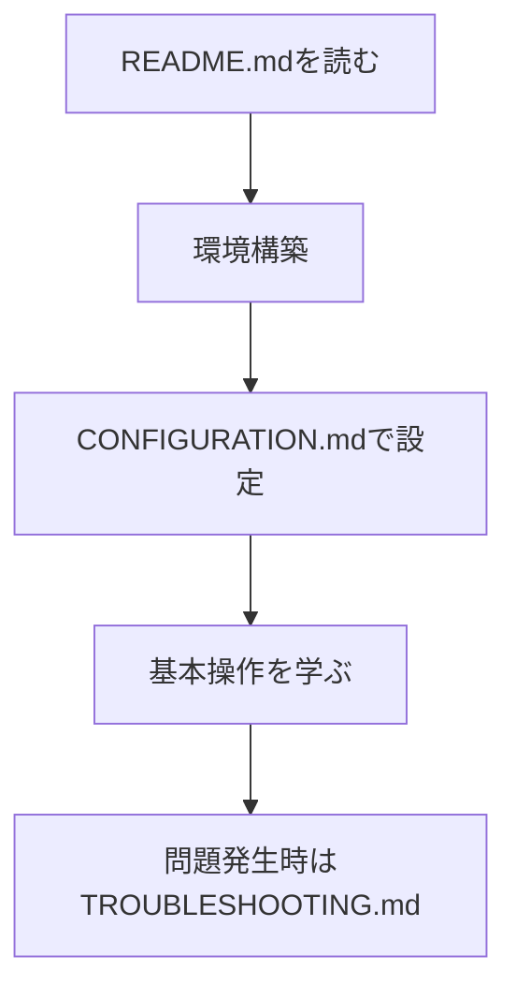
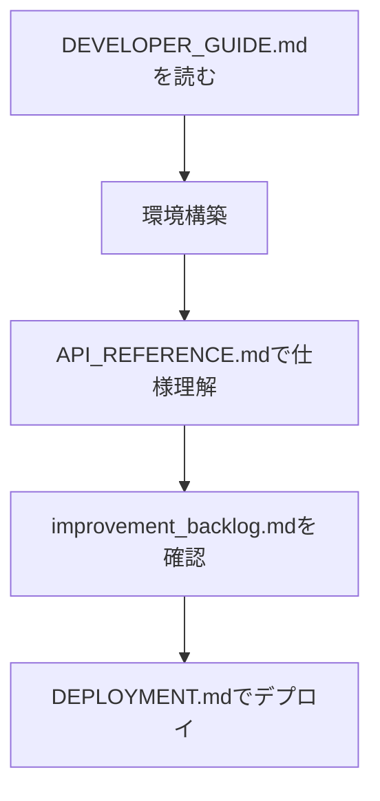

# Cocoa ドキュメント / Cocoa Documentation

## 概要 / Overview

Cocoaはプロフェッショナルなアバター管理システムで、個人からエンタープライズレベルまで対応します。本ドキュメントスイートでは、開発、運用、トラブルシューティングに必要なすべての情報を提供します。

## 主要機能 / Key Features

- **多言語対応**: 50言語以上のサポート
- **セキュリティ**: AES-256-GCM暗号化、監査ログ
- **バックアップ**: 自動検証、災害復旧
- **監視**: ヘルスチェック、パフォーマンスメトリクス
- **設定管理**: 包括的な検証システム

## ドキュメント一覧 / Documentation Index

### 📚 ユーザー向け / User Documentation

| ドキュメント | 説明 | 対象者 |
|-------------|------|--------|
| [README.md](../README.md) | プロジェクト概要とクイックスタート | 全ユーザー |
| [CONFIGURATION.md](CONFIGURATION.md) | 設定ファイルの詳細設定 | 管理者 |
| [TROUBLESHOOTING.md](TROUBLESHOOTING.md) | 問題解決ガイド | 全ユーザー |

### 🛠️ 開発者向け / Developer Documentation

| ドキュメント | 説明 | 対象者 |
|-------------|------|--------|
| [DEVELOPER_GUIDE.md](DEVELOPER_GUIDE.md) | 開発環境構築と手法 | 開発者 |
| [API_REFERENCE.md](API_REFERENCE.md) | 完全なAPI仕様 | 開発者 |
| [DEPLOYMENT.md](../DEPLOYMENT.md) | 本番環境デプロイ | DevOps |

### 📊 その他 / Additional Resources

| ドキュメント | 説明 |
|-------------|------|
| [improvement_backlog.md](improvement_backlog.md) | 改善項目バックログ |

## 利用開始ガイド / Getting Started Guide

### 初めての方 / New Users



### 開発参加者 / Developers



## サポート / Support

### 📧 お問い合わせ / Contact

- **ドキュメント改善**: [GitHub Issues](https://github.com/shizukutanaka/Cocoa/issues)
- **技術サポート**: ドキュメント内のトラブルシューティングを参照

### 🔍 検索 / Search

各ドキュメント内で `Ctrl+F` (Windows/Linux) または `Cmd+F` (macOS) を使用してキーワード検索できます。

## 貢献 / Contributing

ドキュメントの改善にご協力いただける場合は：

1. [DEVELOPER_GUIDE.md](DEVELOPER_GUIDE.md) を読み、開発環境を構築
2. [improvement_backlog.md](improvement_backlog.md) で改善項目を確認
3. プルリクエストを作成

---

**最終更新 / Last Updated**: 2025-10-13
**バージョン / Version**: 2.0.0
3. [TROUBLESHOOTING.md](TROUBLESHOOTING.md) - 運用時のトラブル対応
4. [DEVELOPER_GUIDE.md](DEVELOPER_GUIDE.md) の「パフォーマンス」セクション

## ドキュメントの状態

| ドキュメント | 状態 | 最終更新 | 次回更新予定 |
|-------------|------|----------|--------------|
| README.md | 完了 | 2024-01-15 | - |
| DEVELOPER_GUIDE.md | 完了 | 2024-01-15 | 月次更新 |
| API_REFERENCE.md | 完了 | 2024-01-15 | API変更時 |
| CONFIGURATION.md | 完了 | 2024-01-15 | 設定変更時 |
| TROUBLESHOOTING.md | 完了 | 2024-01-15 | 問題報告時 |
| DEPLOYMENT.md | 完了 | 2024-01-15 | 環境変更時 |
| ARCHITECTURE.md | 作成予定 | - | 2024-02-01 |
| SECURITY.md | 作成予定 | - | 2024-02-15 |

## ドキュメント検索

### よく検索される内容

- **起動方法**: [DEVELOPER_GUIDE.md](DEVELOPER_GUIDE.md#環境構築)
- **設定変更**: [CONFIGURATION.md](CONFIGURATION.md#メイン設定-configjson)
- **APIキー取得**: [API_REFERENCE.md](API_REFERENCE.md#認証)
- **エラー対処**: [TROUBLESHOOTING.md](TROUBLESHOOTING.md#一般的な問題)
- **パフォーマンス最適化**: [DEVELOPER_GUIDE.md](DEVELOPER_GUIDE.md#パフォーマンス)
- **セキュリティ設定**: [DEPLOYMENT.md](../DEPLOYMENT.md#セキュリティ設定)

### キーワード別インデックス

#### セキュリティ
- 認証設定: [API_REFERENCE.md](API_REFERENCE.md#認証)
- パスワード管理: [TROUBLESHOOTING.md](TROUBLESHOOTING.md#ログインできない)
- セキュリティ監査: [DEVELOPER_GUIDE.md](DEVELOPER_GUIDE.md#セキュリティ)
- SSL/TLS設定: [DEPLOYMENT.md](../DEPLOYMENT.md#ssltls設定)

#### パフォーマンス
- 最適化ガイド: [DEVELOPER_GUIDE.md](DEVELOPER_GUIDE.md#パフォーマンス)
- 設定チューニング: [CONFIGURATION.md](CONFIGURATION.md#パフォーマンス設定)
- 遅延問題: [TROUBLESHOOTING.md](TROUBLESHOOTING.md#アプリケーションが遅い)
- パフォーマンステスト: [DEVELOPER_GUIDE.md](DEVELOPER_GUIDE.md#テスト)

#### データベース
- 接続設定: [CONFIGURATION.md](CONFIGURATION.md#データベース設定-databasejson)
- 移行手順: [DEVELOPER_GUIDE.md](DEVELOPER_GUIDE.md#開発ワークフロー)
- 接続エラー: [TROUBLESHOOTING.md](TROUBLESHOOTING.md#データベース接続エラー)

#### ネットワーク
- ポート設定: [CONFIGURATION.md](CONFIGURATION.md#web管理インターフェース設定)
- プロキシ設定: [DEPLOYMENT.md](../DEPLOYMENT.md#ssltls設定)

## ドキュメント貢献ガイド

### ドキュメント更新手順

1. **Issue報告**: 社内課題管理システムを利用してください。
2. **コミュニティ**: 現在提供していません。社内ナレッジとチームチャットを活用してください。
3. **メール**: 専用窓口は提供していません。社内サポートフローに従ってください。
4. **編集**: Markdownファイルを編集
5. **レビュー**: Pull Requestでレビュー依頼
6. **マージ**: レビュー完了後にマージ

### ドキュメント作成ガイドライン

- H1は1つのファイルに1つのみ
- 目次を必ず含める
- コードブロックには言語指定
- 外部リンクと内部リンクを明確に区別

#### コンテンツ
- 実用的な例を豊富に含める
- スクリーンショットは適切に使用
- エラーメッセージと解決策をペアで記載

#### 国際化対応
- 日本語版を基本とし、英語版も提供予定
- 技術用語は英語併記

### テンプレート

新しいドキュメントを作成する場合は、以下のテンプレートを使用してください：

```markdown
# ドキュメントタイトル

## 目次
- [概要](#概要)
- [主要セクション](#主要セクション)
- [例](#例)
- [トラブルシューティング](#トラブルシューティング)
- [参考資料](#参考資料)

## 概要

ドキュメントの目的と対象読者を明記します。

## 主要セクション

### セクション1

内容...

### セクション2

内容...

## 例

実用的なコード例やコマンド例を記載します。

## トラブルシューティング

よくある問題と解決策をまとめます。

## 参考資料

- [関連ドキュメント](link)
- [外部リソース](link)

---

最終更新: YYYY-MM-DD
作成者: [名前]
次回更新予定: YYYY-MM-DD
```

## ドキュメント更新履歴

### v2.0.0 (2024-01-15)
- 全ドキュメントの初回作成完了
- API リファレンス v1.0 完成
- 開発者ガイド v1.0 完成
- 設定リファレンス v1.0 完成
- トラブルシューティングガイド v1.0 完成

### 予定される更新

#### v2.1.0 (2024-02-01)
- システムアーキテクチャドキュメント追加
- セキュリティガイドライン追加
- API v2 β版のドキュメント追加

#### v2.2.0 (2024-03-01)
- プラグイン開発ガイド追加
- パフォーマンスベンチマーク追加
- 英語版ドキュメント公開

## コミュニティ

### ドキュメント改善への参加

- **Issue報告**: ローカルの`docs/improvement_backlog.md`を参照し、必要な改善事項を記録してください。
- **Pull Request**: プロジェクトチーム内のコードレビュー手順に従って変更を共有してください。

### サポートチャンネル

- オンラインコミュニティや外部メール窓口は現在提供していません。社内ドキュメントとチームチャットを利用してください。

---

## ライセンス

このドキュメントは [MIT License](../LICENSE) の下で公開されています。

## 謝辞
Cocoaドキュメントの改善にご協力いただいたすべてのコントリビューターに感謝いたします。